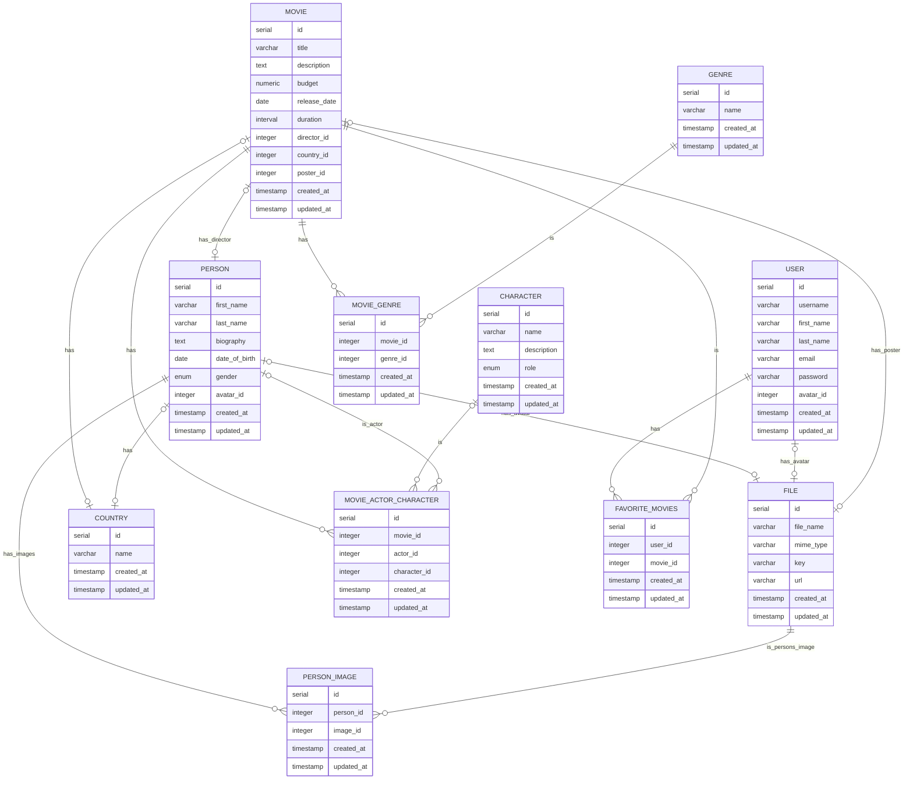

# Movies DB

ER-diagram of Movies database

```mermaid
erDiagram
    USER {
        serial id
        varchar username
        varchar first_name
        varchar last_name
        varchar email
        varchar password
        integer avatar_id
        timestamp created_at
        timestamp updated_at
    }
    FILE {
        serial id
        varchar file_name
        varchar mime_type
        varchar key
        varchar url
        timestamp created_at
        timestamp updated_at
    }
    MOVIE {
        serial id
        varchar title
        text description
        numeric budget
        date release_date
        interval duration
        integer director_id
        integer country_id
        integer poster_id
        timestamp created_at
        timestamp updated_at
    }
    CHARACTER {
        serial id
        varchar name
        text description
        enum role
        timestamp created_at
        timestamp updated_at
    }
    PERSON {
        serial id
        varchar first_name
        varchar last_name
        text biography
        date date_of_birth
        enum gender
        integer avatar_id
        timestamp created_at
        timestamp updated_at
    }
    COUNTRY {
        serial id
        varchar name
        timestamp created_at
        timestamp updated_at
    }
    GENRE {
        serial id
        varchar name
        timestamp created_at
        timestamp updated_at
    }
    MOVIE_GENRE {
        serial id
        integer movie_id
        integer genre_id
        timestamp created_at
        timestamp updated_at
    }
    PERSON_IMAGE {
        serial id
        integer person_id
        integer image_id
        timestamp created_at
        timestamp updated_at
    }
    MOVIE_ACTOR_CHARACTER {
        serial id
        integer movie_id
        integer actor_id
        integer character_id
        timestamp created_at
        timestamp updated_at
    }
    FAVORITE_MOVIES {
        serial id
        integer user_id
        integer movie_id
        timestamp created_at
        timestamp updated_at
    }

    PERSON ||--o{ PERSON_IMAGE: has_images
    FILE ||--o{ PERSON_IMAGE: is_persons_image
    PERSON |o--o| FILE: has_avatar
    USER |o--o| FILE: has_avatar
    MOVIE |o--o| PERSON: has_director
    MOVIE |o--o| COUNTRY: has
    MOVIE ||--o{ MOVIE_GENRE: has
    GENRE ||--o{ MOVIE_GENRE: is
    MOVIE |o--o| FILE: has_poster
    MOVIE ||--o{ MOVIE_ACTOR_CHARACTER: has
    CHARACTER |o--o{ MOVIE_ACTOR_CHARACTER: is
    PERSON |o--o{ MOVIE_ACTOR_CHARACTER: is_actor
    PERSON |o--o| COUNTRY: has
    USER ||--o{ FAVORITE_MOVIES: has
    MOVIE ||--o{ FAVORITE_MOVIES: is
```
